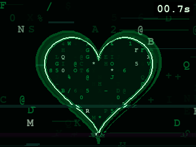

# RpiZero2WDisplay

On-demand display and touch tooling for a **Raspberry Pi Zero 2 W** running **DietPi CLI mode** with a **Waveshare 2.8inch RPi LCD (A)**.

This repository keeps the Pi lightweight: no LightDM, no full desktop, and no permanent GUI session. Python, camera, pygame, OpenCV, tkinter, Qt, or matplotlib apps can be launched on the LCD only when needed.

## Preview

| Static Green Heart | Animated Green Heart |
| --- | --- |
|  |  |

## Table Of Contents

- [Preview](#preview)
- [Tested Setup](#tested-setup)
- [What This Provides](#what-this-provides)
- [Repository Layout](#repository-layout)
- [Quick Start](#quick-start)
- [Matrix-Style Demos](#matrix-style-demos)
- [Fresh Display Setup](#fresh-display-setup)
- [On-Demand X11 Runtime](#on-demand-x11-runtime)
- [Running GUI Apps](#running-gui-apps)
- [Touchscreen Calibration](#touchscreen-calibration)
- [Direct Framebuffer Mode](#direct-framebuffer-mode)
- [Troubleshooting](#troubleshooting)
- [License](#license)

## Tested Setup

| Component | Value |
| --- | --- |
| Board | Raspberry Pi Zero 2 W |
| OS | DietPi / Debian Trixie |
| Display | Waveshare 2.8inch RPi LCD (A) |
| Overlay | `waveshare28a-v2` |
| LCD framebuffer | `/dev/fb1` |
| X11 detected size | `320x240` |
| Touch controller | `ADS7846 Touchscreen` |
| Touch driver | `evdev` |
| GUI strategy | Temporary X11 session only when a command needs the screen |

## What This Provides

- Installs and configures the Waveshare 2.8A overlay.
- Keeps DietPi in CLI/CUI mode.
- Maps `tty1` to the LCD framebuffer with `con2fbmap`.
- Adds an on-demand X11 launcher for GUI applications.
- Adds ADS7846 touchscreen calibration for X11.
- Provides a Matrix-glitch pygame heart demo with a code-filled heart material.
- Provides an optimized Matrix-glitch animated pygame demo with cached frames and stronger horizontal glitch bands.
- Provides a pygame touch tester for coordinate verification.
- Avoids enabling a permanent desktop environment.

## Repository Layout

| Path | Purpose |
| --- | --- |
| `setup_waveshare28a_display.sh` | Full boot/display setup for a fresh DietPi image. |
| `install_lcd_x11_on_demand.sh` | Installs the X11 framebuffer runtime used by temporary GUI sessions. |
| `install_touch_calibration.sh` | Installs ADS7846 touchscreen calibration for X11. |
| `lcd-run.sh` | Runs a command on the LCD through temporary X11 or direct framebuffer mode. |
| `run_heart_waveshare28a.sh` | Convenience launcher for the Matrix-style pygame heart demo. |
| `run_animation_waveshare28a.sh` | Convenience launcher for the animated pygame demo. |
| `heart_display.py` | Matrix-glitch pygame display test with a code-filled heart and glitch-only overlay. |
| `heart_animation.py` | Optimized Matrix-glitch animated heart with cached glyph/heart frames and stronger horizontal glitch bands. |
| `touch_test.py` | Pygame touch coordinate test app. |
| `heart_preview.png` | Offscreen-rendered preview of the heart demo. |
| `animation_preview.png` | Offscreen-rendered preview frame of the animation demo. |

## Quick Start

Clone the repository on the Pi:

```bash
cd /home/dietpi
git clone git@github.com:tirofina/RpiZero2WDisplay.git
cd RpiZero2WDisplay
```

If the Waveshare overlay has already been configured and `/dev/fb1` exists, install only the on-demand GUI runtime and touch calibration:

```bash
sudo ./install_lcd_x11_on_demand.sh
sudo ./install_touch_calibration.sh
```

Run the display demo:

```bash
./run_heart_waveshare28a.sh
```

Run a short 10-second test:

```bash
duration=10 ./run_heart_waveshare28a.sh
```

If the display size must be forced, use the current framebuffer size:

```bash
SIZE=320x240 duration=10 ./run_heart_waveshare28a.sh
```

Run the animation demo:

```bash
duration=10 ./run_animation_waveshare28a.sh
```

## Matrix-Style Demos

The demos use a black-and-green Matrix-glitch visual treatment: sparse digital glyph fields, neon green heart outlines, dark shadows, changing glyphs, and stronger horizontal glitch displacement. The heart surfaces are filled with code texture instead of flat color.

### Static Green Heart

`heart_display.py` renders a centered neon green heart over a sparse Matrix-style glyph field. The heart is not a flat fill: its interior is clipped code texture, the outline uses layered green glow strokes, and the final frame gets stronger horizontal glitch offsets.


Recommended command:

```bash
./run_heart_waveshare28a.sh
```

Short test:

```bash
duration=10 ./run_heart_waveshare28a.sh
```

Force the verified Waveshare framebuffer size:

```bash
SIZE=320x240 duration=10 ./run_heart_waveshare28a.sh
```

Save one rendered frame without using the LCD:

```bash
python3 heart_display.py --sdl-driver=offscreen --size 240x320 --duration 0.1 --save heart_preview.png
```

### Animated Green Heart

`heart_animation.py` is a lightweight pygame animation for checking that the on-demand X11 path can render moving graphics smoothly on the Waveshare LCD. It precomputes glyph, background, heart, and glitch frames at startup, then reuses cached surfaces during playback to reduce CPU load on the Raspberry Pi Zero 2 W. The background uses a sparse Matrix-style glyph field with characters that mutate over time, plus stronger horizontal glitch bands. It draws:


- sparse Matrix-style glyph fields with changing characters,
- a pulsing neon green heart with code texture inside the shape,
- layered Matrix-green heart outlines and glow,
- stronger horizontal glitch displacement,
- a small elapsed-time label.

Recommended command:

```bash
./run_animation_waveshare28a.sh
```

Short test:

```bash
duration=10 ./run_animation_waveshare28a.sh
```

Force the verified Waveshare framebuffer size:

```bash
SIZE=320x240 duration=10 ./run_animation_waveshare28a.sh
```

The launcher defaults to `FPS=15` for the Pi Zero 2 W. Lower the frame rate if the Pi is still busy:

```bash
FPS=10 duration=10 ./run_animation_waveshare28a.sh
```

Run it directly through the generic launcher:

```bash
./lcd-run.sh x python3 heart_animation.py --size 320x240 --duration 10
```

Save one rendered frame without using the LCD:

```bash
python3 heart_animation.py --sdl-driver=offscreen --size 320x240 --duration 0.2 --save-frame animation_preview.png
```

## Fresh Display Setup

Use this section when preparing a new DietPi image for the Waveshare LCD.

```bash
cd /home/dietpi/RpiZero2WDisplay
sudo bash setup_waveshare28a_display.sh
```

Common options:

```bash
sudo bash setup_waveshare28a_display.sh --rotate 90
sudo bash setup_waveshare28a_display.sh --no-reboot
sudo bash setup_waveshare28a_display.sh --user dietpi
sudo bash setup_waveshare28a_display.sh --no-autologin
sudo bash setup_waveshare28a_display.sh --no-con2fbmap
```

The setup script:

1. Installs DietPi/Trixie-compatible display packages.
2. Downloads and installs `waveshare28a-v2.dtbo`.
3. Enables SPI.
4. Configures the Waveshare LCD overlay.
5. Configures the ADS7846 touch overlay.
6. Disables KMS/FKMS overlays that conflict with this framebuffer setup.
7. Adds `consoleblank=0`.
8. Writes X11 touch calibration.
9. Maps `tty1` to `fb1` using `con2fbmap`.
10. Optionally enables `tty1` autologin.

The script writes backups under:

```text
/var/backups/waveshare28a-setup/
```

Logs are written under:

```text
/var/log/waveshare28a-setup/
```

## On-Demand X11 Runtime

The recommended path for this device is a temporary X11 session. This avoids running a desktop all the time while still supporting GUI programs that need X11.

Install the runtime once:

```bash
sudo ./install_lcd_x11_on_demand.sh
```

This installs:

- `xserver-xorg`
- `xinit`
- `x11-xserver-utils`
- `xserver-xorg-video-fbdev`
- `xserver-xorg-input-evdev`
- `xinput`
- `xinput-calibrator`
- `openbox`

It also writes:

```text
/etc/X11/xorg.conf.d/98-waveshare28a-fbdev.conf
```

That file points X11 at:

```text
/dev/fb1
```

## Running GUI Apps

Use `lcd-run.sh x` for programs that require X11:

```bash
./lcd-run.sh x COMMAND [ARGS...]
```

Examples:

```bash
./lcd-run.sh x python3 heart_display.py
./lcd-run.sh x python3 heart_animation.py --size 320x240
./lcd-run.sh x python3 touch_test.py --size 320x240
./lcd-run.sh x python3 camera_gui.py
./lcd-run.sh x python3 opencv_preview.py
```

For OpenCV code using `cv2.imshow`, run it through the temporary X11 mode:

```bash
./lcd-run.sh x python3 camera_gui.py
```

The session lifecycle is:

1. `lcd-run.sh` starts X11 on the LCD.
2. Your command runs inside that X11 session.
3. When your command exits, X11 exits.
4. DietPi returns to normal CLI mode.

## Touchscreen Calibration

Install the ADS7846 calibration:

```bash
sudo ./install_touch_calibration.sh
```

Default calibration values:

| Setting | Value |
| --- | --- |
| `MatchProduct` | `ADS7846 Touchscreen` |
| `Driver` | `evdev` |
| `Calibration` | `3821 182 300 3786` |
| `SwapAxes` | `0` |

The calibration file is written to:

```text
/etc/X11/xorg.conf.d/99-calibration.conf
```

List X11 input devices:

```bash
./lcd-run.sh x xinput list
```

Expected device:

```text
ADS7846 Touchscreen
```

Check applied touch properties:

```bash
sudo ./lcd-run.sh x xinput list-props 6
```

Expected properties:

```text
Evdev Axis Calibration: 3821, 182, 300, 3786
Evdev Axes Swap: 0
```

Run the touch coordinate tester:

```bash
./lcd-run.sh x python3 touch_test.py --size 320x240
```

If X/Y axes are swapped:

```bash
sudo SWAP_AXES=1 ./install_touch_calibration.sh
```

If left/right is reversed:

```bash
sudo CALIBRATION="182 3821 300 3786" ./install_touch_calibration.sh
```

If top/bottom is reversed:

```bash
sudo CALIBRATION="3821 182 3786 300" ./install_touch_calibration.sh
```

After changing calibration, run the touch tester again:

```bash
./lcd-run.sh x python3 touch_test.py --size 320x240
```

## Direct Framebuffer Mode

Direct framebuffer mode can work only if the installed SDL build supports a console video driver.

Many current pygame/SDL2 builds do **not** include `fbcon`. If you see this error, it is expected:

```text
fbcon not available
```

Use temporary X11 mode instead:

```bash
./lcd-run.sh x python3 heart_display.py
```

If you still want to test direct framebuffer mode:

```bash
sudo env RUN_MODE=fb SDL_DRIVER=kmsdrm duration=10 ./run_heart_waveshare28a.sh
```

Framebuffer mode targets:

```text
SDL_FBDEV=/dev/fb1
```

## Preview Without LCD

Render the heart demo without using the LCD:

```bash
python3 heart_display.py --sdl-driver=offscreen --size 240x320 --duration 0.1 --save heart_preview.png
```

## Environment Variables

| Variable | Default | Description |
| --- | --- | --- |
| `FBDEV` | `/dev/fb1` | Framebuffer device used by the launchers. |
| `RUN_MODE` | `x` | `x` for temporary X11, `fb` for direct framebuffer mode. |
| `SDL_DRIVER` | `auto` | SDL driver used in framebuffer mode, for example `kmsdrm`. |
| `SIZE` | unset | Optional forced render size, for example `320x240`. |
| `duration` | `0` | Demo duration in seconds. `0` waits until quit. `DURATION` is still accepted as a compatibility alias. |
| `FPS` | `15` | Animation frame rate used by `run_animation_waveshare28a.sh`. Use `FPS=10` on slower runs. |
| `PYTHON_BIN` | `python3` | Python interpreter used by `run_heart_waveshare28a.sh`. |
| `DISPLAY_NUM` | `:1` | Temporary X11 display number used by `lcd-run.sh x`. |

## Troubleshooting

### `/dev/fb1` does not exist

Check available framebuffers:

```bash
ls /dev/fb*
```

If only `/dev/fb0` appears, reboot after running the display setup:

```bash
sudo reboot
```

### The app opens but touch coordinates are wrong

Use the actual X11 framebuffer size:

```bash
./lcd-run.sh x python3 touch_test.py --size 320x240
```

Then adjust `CALIBRATION` or `SWAP_AXES` with `install_touch_calibration.sh`.

### `parse_vt_settings: Cannot open /dev/tty0`

This can happen when starting X11 from a non-console remote session. Running through `sudo` usually fixes it:

```bash
sudo ./lcd-run.sh x python3 touch_test.py --size 320x240
```

### `fbcon not available`

The installed SDL2 build does not include `fbcon`. Use temporary X11 mode:

```bash
./lcd-run.sh x python3 heart_display.py
```

### ALSA warnings appear

Warnings like `Unknown PCM default` are audio-related and do not usually affect display output.

## Notes

- The setup intentionally avoids enabling a full desktop.
- The X11 session is temporary and command-scoped.
- The verified X11 size for the tested Waveshare setup is `320x240`.
- Touch calibration is applied by X11 when the temporary session starts.
- Private SSH keys should never be committed or shared.

## License

This project is licensed under the MIT License. See [LICENSE](LICENSE).
